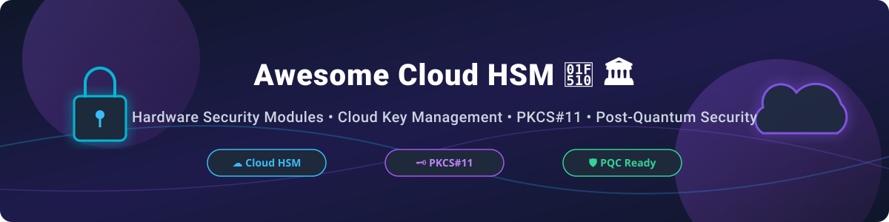

# Awesome-Cloud-Hardware-Security-Module-HSM

# Awesome-Cloud-Hardware-Security-Module-HSM 🔐 🏛️

  

  

  

  

  

  

  

---

## 🌟 Top Cloud Hardware Security Module (HSM) Ecosystem

**Curated List of Commercial HSM Platforms & Open-Source Cryptographic Key Management Tools**  

*Focused on Key Management as a Service, PKCS#11 Integration, Post-Quantum Cryptography, Payment HSM & Self-Hosted Software HSMs*  

**Last updated: October 2026** 📅

---

### 📌 Overview & SEO Summary

Welcome to the ultimate curated directory of **cloud hardware security modules**, **open-source PKCS#11 tools**, and **cryptographic key management frameworks**. The HSM-as-a-Service market is growing rapidly due to **technological improvements in encryption**, **increasing cybersecurity threats**, **cloud adoption**, and **regulatory pressure** (GDPR, HIPAA, PCI DSS). Whether you are looking for enterprise-grade commercial solutions (such as *AWS CloudHSM*, *Azure Dedicated HSM*, and *Thales CipherTrust*), or self-hostable open-source alternatives (like *SoftHSMv2*, *FreeHSM-C*, and *BouncyHsm*), this list covers category leaders, PKCS#11 integrations, and privacy-respecting cryptographic infrastructure.

**Key Market Drivers & Trends:**

- **Post-Quantum Cryptography (PQC) readiness** is a major procurement consideration. Vendors like Thales and Utimaco have committed to PQC-capable firmware updates, with **PQC-ready vs PQC-legacy tiers** already influencing buying decisions in European financial institutions and US federal agencies.

- **Embedded HSM integration** is expanding into IoT, automotive, and industrial automation, driven by regulations like the **EU Cyber Resilience Act** and GSMA IoT Security Guidelines.

- **Blockchain and digital asset security** is a fast-growing demand vector, with institutional custodians and CBDC programs standardizing on HSMs for private key storage and transaction signing.

---

## 📑 Table of Contents

- [🏢 SaaS & Commercial Platforms](#-saas--commercial-platforms)

- [🔓 Open-Source GitHub Projects](#-open-source-github-projects)

- [🛠️ How to Contribute](#%EF%B8%8F-how-to-contribute)

- [📊 Star History](#-star-history)

- [🤝 Support & Sponsorship](#-support--sponsorship)

- [⚠️ Disclaimer](#%EF%B8%8F-disclaimer)

---

## 🏢 SaaS / Commercial Platforms

> 💡 **Market Size & Structure Analysis:** The global Cloud Hardware Security Module (HSM) market is estimated at **$1.45 Billion in 2026** and is projected to reach **$3.8 Billion by 2030** (CAGR ~21.2%). The market is **moderately concentrated** among major cloud hyperscalers (AWS, Azure, GCP) and established security hardware providers (Thales, Entrust, Utimaco), while emerging cloud-native and confidential computing platforms create niche competition.

The HSM-as-a-Service market is dominated by established hardware security vendors and cloud hyperscalers. Key players include **Microsoft, Amazon, Google, Marvell, Thales, Entrust, Utimaco, Futurex, Fortanix, and Securosys**. The market is evolving from **hardware-centric to service-centric paradigms**, driven by cloud adoption, remote HSM management, and multi-tenant architectures.

| SaaS / Commercial Platform | Company / Owner | Market Cap / Revenue / Valuation | Standard Edition Starting Price | Free Tier / Free Trial Limits | Description |
| :--- | :--- | :--- | :--- | :--- | :--- |
| **[Azure Dedicated HSM](https://azure.microsoft.com/en-us/services/hsm/)** 🔷 | Microsoft | ~$3.90 Trillion | **$4.40/hour per HSM device** (~$3,212/month) | **30-day free trial** with $200 Azure credits for new accounts | **Azure-native dedicated HSM** — FIPS 140-2 Level 3. **Thales SafeNet Luna Network HSM 7** appliance. Dedicated single-tenant infrastructure. |
| **[AWS CloudHSM](https://aws.amazon.com/cloudhsm/)** ☁️ | Amazon | ~$2.0 Trillion | **$1.45/hour per HSM instance** (~$1,058.50/month) | **2-month Free Tier trial** ($300 AWS credits) for new accounts | **AWS-native dedicated HSM** — Single-tenant, FIPS 140-2 Level 3 validated. **PKCS#11, JCE, and CNG** interfaces. Customer-controlled keys. |
| **[Google Cloud HSM](https://cloud.google.com/kms/docs/hsm)** 🌐 | Google (Alphabet) | ~$2.0 Trillion | **$1.60/HSM key version/month** + $0.03 per 10k operations | **90-day free trial** with $300 GCP credits for new users | **GCP-native HSM-backed keys** — FIPS 140-2 Level 3. Integrated into **Cloud KMS** for seamless key management. Multi-tenant key-isolated architecture. |
| **[Marvell LiquidSecurity](https://www.marvell.com/)** ⚙️ | Marvell | ~$50 Billion | **$3,500/month starting license** (Cloud HSM Appliance) | **30-day sandbox evaluation account** upon enterprise demo request | **Cloud-optimized HSM** — **LiquidSecurity** network HSM appliances for cloud and enterprise data centers. **Multi-tenant architecture** for service providers. |
| **[Thales CipherTrust Cloud Key Manager](https://cpl.thalesgroup.com/)** 🏛️ | Thales Group | ~$3.2 Billion | **$750/month starting subscription** per tenant | **30-day free trial** available via CipherTrust Data Security Platform | **Enterprise key lifecycle management** — Centralized control across multi-cloud (AWS, Azure, GCP). **Luna Network HSM 7** and **payShield 10K** platforms. |
| **[Entrust nShield as a Service](https://www.entrust.com/)** 🔐 | Entrust | ~$1.0 Billion (Rev ~$800M) | **$1,200/month base plan** (Cloud HSM instance) | **14-day cloud trial** with test HSM HSM-as-a-Service sandbox | **Cloud HSM service** — **nShield Connect** hardware and **nShield as a Service** cloud option. FIPS 140-2 Level 3 with **CodeSafe** secure execution. |
| **[Fortanix DSM](https://www.fortanix.com/)** 🛡️ | Fortanix | Private (~$500M Valuation) | **$500/month SaaS starter plan** | **30-day unlimited free trial** on Fortanix Data Security Manager Cloud | **Data Security Manager** — Multi-cloud HSM-as-a-Service. **FIPS 140-2 Level 3**. **REST API**, PKCS#11, and JCE interfaces. Confidential computing support. |
| **[Utimaco HSM](https://utimaco.com/)** 🔵 | Utimaco | Private (~$400M Valuation) | **$1,500/month managed cloud node** | **30-day virtual HSM simulator trial** available upon request | **Enterprise HSM platform** — **CryptoServer Se-Series** with native **ML-KEM and ML-DSA** (PQC) support. Used in defense, banking, and government. |
| **[Securosys CloudHSM](https://www.securosys.com/)** 🏔️ | Securosys | Private (~$150M Valuation) | **$290/month entry tier** (TSB CloudHSM slot) | **30-day free evaluation** with 2 test HSM slots and REST API access | **Swiss-made HSM platform** — **Primus HSM** with FIPS 140-2 Level 3 and **Swiss banking-grade** security. HashiCorp Vault plugin support. |
| **[Futurex Cloud HSM](https://www.futurex.com/)** 🟢 | Futurex | Private (~$100M Valuation) | **$850/month starter cloud partition** | **30-day VirtuCrypt portal trial** with sandbox HSM partition | **Enterprise HSM and key management** — **Vectera Plus** and **KMES Series 3**. FIPS 140-2 Level 3. Payment HSM for PCI DSS compliance. |

---

## 🔓 Open-Source GitHub Projects

*Sorted by GitHub Stars Count (Descending)* 🌟

- **[OpenSC](https://github.com/OpenSC/OpenSC)**   
  **Open source smart card tools and middleware with PKCS#11/MiniDriver support**, LGPL-2.1 licensed. **3,100+ stars**. **The standard middleware for smart cards and hardware tokens** (YubiKey, Nitrokey, PKCS#11 devices). Supports key generation, signing, and verification across Linux, macOS, and Windows. 💳

- **[SoftHSMv2](https://github.com/softhsm/SoftHSMv2)**   
  **Software implementation of a generic cryptographic device with a PKCS#11 interface**, BSD-2-Clause licensed. **1,100+ stars**. **The reference open-source SoftHSM** — designed to meet OpenDNSSEC requirements. **Supports PKCS#11 v2.40**. Used widely in CI/CD pipelines, dev testing, and lightweight production environments. 🏛️

- **[XiPKI](https://github.com/xipki/xipki)**   
  **High-performance open-source PKI (CA and OCSP responder) with full PQC (ML-DSA / ML-KEM) and PKCS#11 HSM support**, Apache-2.0 licensed. **600+ stars**. **Post-quantum ready enterprise CA/OCSP** with native hardware security module integration via PKCS#11. 🔒

- **[gokeyless](https://github.com/cloudflare/gokeyless)**   
  **Cloudflare's Go implementation of the Keyless SSL/TLS protocol**, BSD-3-Clause licensed. **510+ stars**. **Allows remote private key operations on HSMs** without exposing private keys to edge servers. Essential for multi-cloud and edge security architecture. ⚡

- **[miekg/pkcs11](https://github.com/miekg/pkcs11)**   
  **Go wrapper for PKCS#11 C-API**, BSD-3-Clause licensed. **450+ stars**. **The standard Go library for interfacing with HSMs and PKCS#11 modules**. Used by HashiCorp Vault, Cloudflare, and Kubernetes security plugins. 🦫

- **[tpm2-pkcs11](https://github.com/tpm2-software/tpm2-pkcs11)**   
  **PKCS#11 interface for TPM 2.0 hardware**, BSD-2-Clause licensed. **360+ stars**. **Turns standard TPM 2.0 chips into hardware security modules via PKCS#11**. Maintained by the TPM2 software community. 🛡️

- **[Nitrokey App & Firmware](https://github.com/Nitrokey/nitrokey-app)**   
  **Open-source client and firmware for Nitrokey open-hardware security keys & HSMs**, GPL-3.0 licensed. **290+ stars**. **Open-hardware USB HSM and smartcard solution** for PGP, PKCS#11, and 2FA keys. 🔑

- **[BouncyHsm](https://github.com/harrison314/BouncyHsm)**   
  **Software simulator of HSM and smartcard simulator with HTML UI, REST API and PKCS#11 interface**, MIT licensed. **200+ stars**. **.NET-based** HSM simulator with modern web UI and REST control interface for dev/testing. 🎮

- **[pkcs11-provider (OpenSSL 3.0+)](https://github.com/latchset/pkcs11-provider)**   
  **A PKCS#11 provider for OpenSSL 3.0+**, Apache-2.0 licensed. **125+ stars**. **Enables OpenSSL 3.x to use PKCS#11 tokens (HSMs, smartcards) as cryptographic providers**. Essential for modern OpenSSL 3.x deployments. 🔗

- **[pkcs11-helper](https://github.com/OpenSC/pkcs11-helper)**   
  **Library that simplifies interaction with PKCS#11 providers**, GPL-2.0 licensed. **70+ stars**. **Abstracts PKCS#11 complexity** for application developers. Used by OpenVPN and security appliances. 🛠️

- **[pkcs11-proxy](https://github.com/SUNET/pkcs11-proxy)**   
  **Network proxy for a PKCS#11 library**, BSD-2-Clause licensed. **65+ stars**. **Enables remote network access to PKCS#11 tokens**. Ideal for containerized environments accessing shared hardware HSMs. 🌐

- **[pkcs11-key-wrap](https://github.com/smallstep/pkcs11-key-wrap)**   
  **Wrap keys from HSM using CKM_RSA_AES_KEY_WRAP**, Apache-2.0 licensed. **13+ stars**. **Demonstrates secure key export/import from HSM**. Essential for key escrow and migration workflows. 📦

- **[pkcs11mod](https://github.com/namecoin/pkcs11mod)**   
  **Go library for creating PKCS#11 modules**, MIT licensed. **13+ stars**. **Enables writing PKCS#11 modules in Go** without CGO complexity. Used in decentralized cryptographic systems. 🦫

- **[FreeHSM-C](https://github.com/afchine1337/freehsm-c)**   
  **Native C11 re-implementation of FreeHSM PKCS#11 v3.2 Soft HSM**, Apache-2.0 licensed. **4 stars**. **Targeted at FIPS 140-3 Level 1 evaluation** and Common Criteria EAL4+ certification. 🎯

---

## 🛠️ How to Contribute

Contributions are welcome! Follow these steps to submit new HSM platforms or open-source cryptographic software:

1. 🍴 **Fork** the repository.

2. 📝 **Add/edit** entries in `README.md` maintaining table/list structure and formatting.

3. 🔗 Include project title, official website/GitHub link, exact Stars_Count, license, and brief description.

4. 🚀 Submit a **Pull Request** with a descriptive summary of your changes.

---

## 📈 Star History

---

## 🤝 Support & Sponsorship

If you find this HSM repository useful, please consider supporting the project:

- ⭐ **Star** this repository to increase visibility!

- 🔀 **Fork** and share with fellow security engineers, cryptographers, and open-source advocates.

- ☕ **Sponsor & Buy Me a Coffee**: Support ongoing open-source curation via the [GitHub Sponsor Dashboard](https://github.com/sponsors/ishandutta2007).

---

## ⚠️ Disclaimer

- This is a **community-curated** list — not exhaustive and not an endorsement. ℹ️

- **HSM-as-a-Service market challenges**: High initial costs, complexity of integration with legacy systems, and regulatory variations across regions can limit adoption. **Data sovereignty concerns** and **vendor lock-in** remain significant barriers in regulated industries.

- **PQC readiness is critical**: HSMs that are not certified or firmware-upgradeable to support **ML-KEM and ML-DSA** will reach **functional obsolescence** as government and regulated enterprise customers align procurement to new standards. **Thales, Utimaco, and IBM** have committed to PQC-ready platforms.

- **SoftHSMv2 is a software implementation** — it provides PKCS#11 interface compatibility but **does not offer the physical tamper-resistance** of hardware HSMs. **Use for development, testing, or non-critical scenarios** where FIPS 140-2 Level 3 validation is not required.

- **FreeHSM-C is newly accepted into Debian** — it aims for **FIPS 140-3 Level 1** and **Common Criteria EAL4+** certification, but **certification is pending**. **Verify certification status** before relying on it for compliance-critical deployments.

- **Open-source PKCS#11 tools (pkcs11-tools, pkcs11-helper, hsmwiz) simplify HSM integration** but **do not replace the need for proper key lifecycle management**. **Always implement secure key backup, rotation, and destruction procedures** regardless of the HSM platform. 🔐

---

  <b>Made with ❤️ for security engineers, cryptographers, and open-source HSM advocates.</b>

